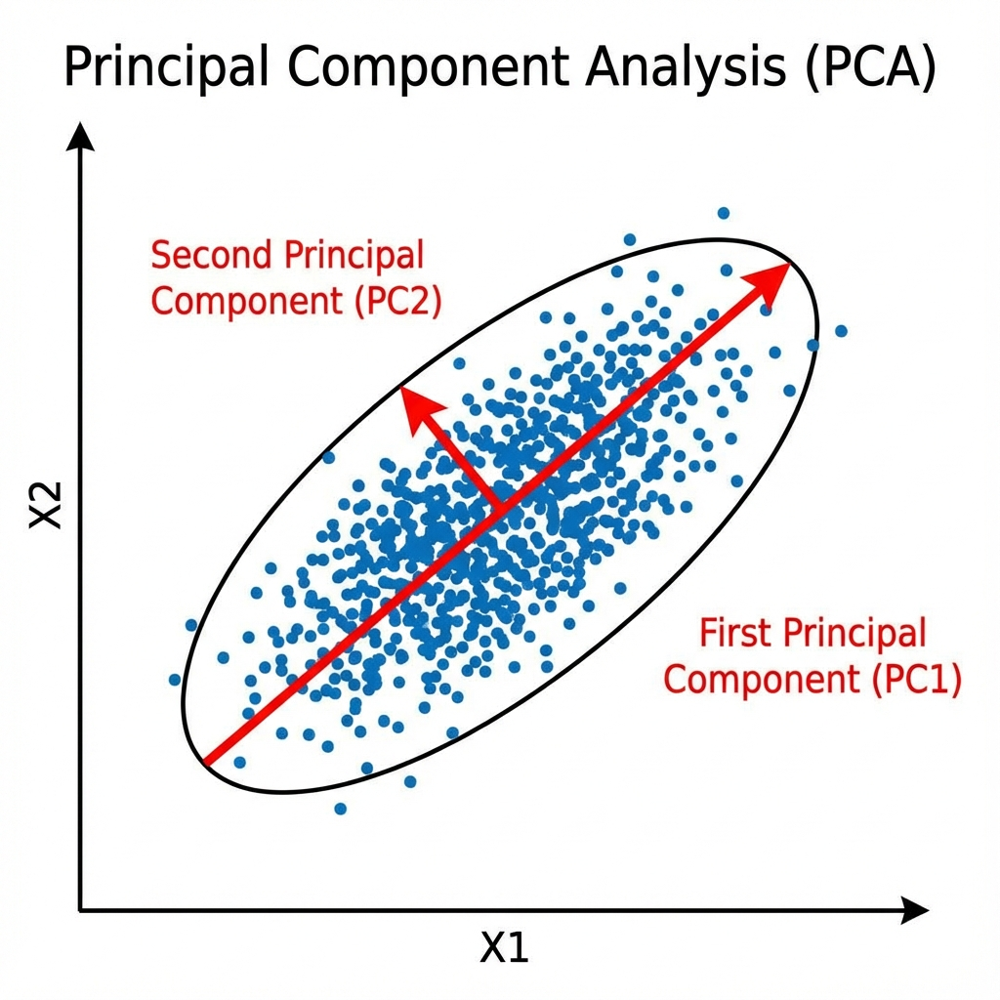
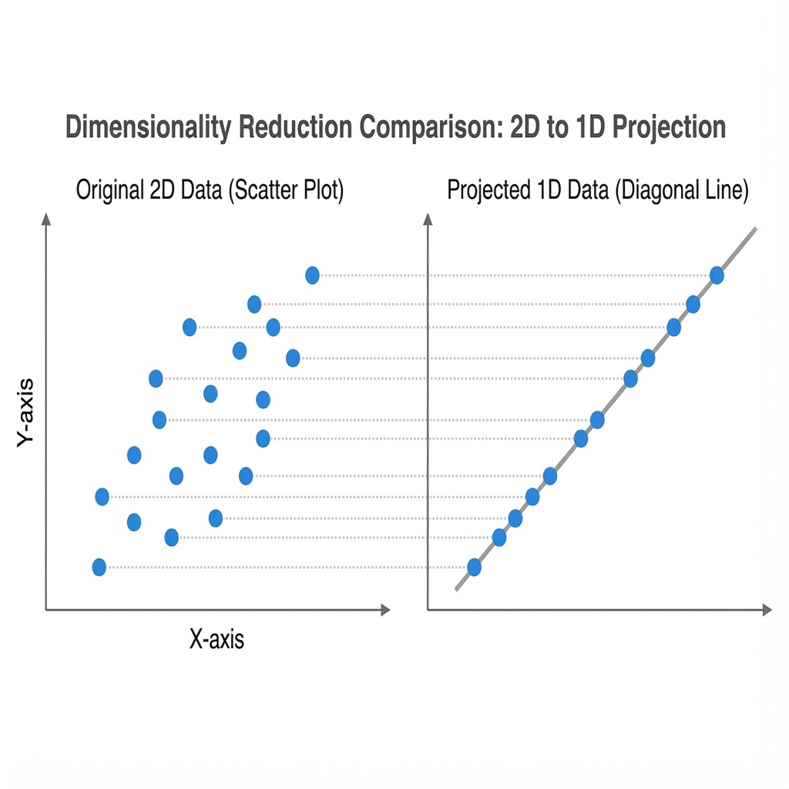
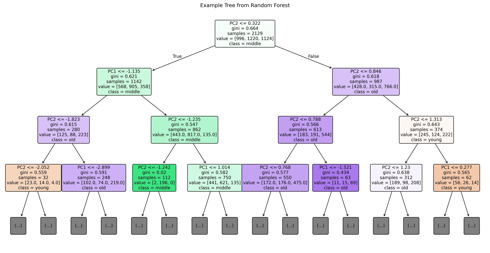

# PCA from Scratch — Abalone Age & Sex Prediction

> *How much information do you lose by collapsing 9 dimensions into 2?*

4,177 abalones. 9 measurements. PCA built step-by-step from the covariance matrix up — then validated, projected, and used to train classifiers that reach 92% accuracy on 2 features.

---

## What This Project Does

We implement PCA manually using NumPy — computing the covariance matrix, eigendecomposition, explained variance, and projection — without any sklearn wrapper. The result is a 2D embedding that retains 87.4% of the original information. We then compare against sklearn's PCA (results match exactly), run a regression baseline, and finally train a neural network that achieves >92% accuracy on both age classification and sex prediction from the two principal components alone.

---

## Results

### The Dataset

4,177 abalone samples. Features: Sex (M/F/I), Length, Diameter, Height, Whole weight, Shucked weight, Viscera weight, Shell weight, and Rings (age proxy). 2 extreme height outliers removed → 4,175 rows. Sex encoded as 0/1/2.

All 8 numeric features are non-normal (D'Agostino-Pearson test, all p < 0.001). The weight features are extremely collinear — correlations of 0.88–0.97 with each other. This is exactly the redundancy PCA is designed to compress.

---

### Explained Variance — What the Components Capture

| Component | Eigenvalue | Variance Explained | Cumulative |
|---|---|---|---|
| PC1 | 7.083 | **78.7%** | 78.7% |
| PC2 | 0.777 | **8.6%** | 87.4% |
| PC3 | 0.665 | 7.4% | 94.8% |
| PC4–PC9 | < 0.19 | 5.2% | 100% |

One component captures nearly 80% of all variance. The first two together reach 87.4%. This is the direct consequence of the near-perfect multicollinearity in the weight and size features — they're all measuring essentially the same thing from different angles.

---

### PCA Step-by-Step



The covariance matrix of the standardized data shows the structure clearly: the 7 physical measurement features (Length through Shell weight) form a dense high-correlation block. Sex is negatively correlated with everything (~-0.44 to -0.46). Rings is moderately correlated with physical features (0.42–0.63), with Shell weight being the best single predictor (r=0.63).

The projection matrix (the two leading eigenvectors):

| Feature | PC1 loading | PC2 loading |
|---|---|---|
| Sex | -0.200 | **+0.835** |
| Length | +0.362 | +0.109 |
| Diameter | +0.363 | +0.087 |
| Height | +0.352 | +0.024 |
| Whole weight | **+0.367** | +0.135 |
| Shucked weight | +0.352 | +0.207 |
| Viscera weight | +0.358 | +0.143 |
| Shell weight | +0.360 | +0.057 |
| Rings | +0.238 | -0.446 |

**PC1** is a near-uniform size/weight axis — all physical measurements load positively with similar magnitude. It measures *how big the abalone is*.

**PC2** is primarily a Sex vs. Rings contrast — Sex loads strongly positive (+0.835), Rings loads negative (-0.446). It separates infants (I) from older adult males and females.



---

### Sklearn Validation

Manual implementation matches sklearn's `PCA(n_components=2)` exactly:

```
Manual explained variance (first 2):  [78.701, 8.631]
Sklearn explained variance (first 2): [78.701, 8.631]
```

---

### Regression Baseline — PCA Loses Almost Nothing

| Model | Features | R² |
|---|---|---|
| Linear Regression (baseline) | All 8 features (scaled) | 0.566 |
| Linear Regression (PCA) | 2 PCA components | **0.592** |

PCA with 2 components slightly *outperforms* using all 8 features. The redundant collinear features add noise to the regression; PCA's compression strips that noise out.

---

### Age Classification — Binned Groups

Rings are grouped into three age categories:

| Class | Rings | Support (test) |
|---|---|---|
| Young | 1–8 | 284 |
| Middle | 9–10 | 276 |
| Old | 11+ | 275 |

**Random Forest (200 trees, max_depth=7):** 80% accuracy on 2 PCA features.

| Class | Precision | Recall | F1 |
|---|---|---|---|
| Young | 0.91 | 0.80 | 0.85 |
| Middle | 0.69 | 0.83 | 0.75 |
| Old | 0.85 | 0.77 | 0.81 |
| **Weighted avg** | **0.82** | **0.80** | **0.81** |

Young abalones are easiest to identify (91% precision). Middle is the hardest class — the 9–10 ring range is a narrow band in the middle of a continuous distribution.



*One example tree from the forest (depth-3 view). PC1 does most of the work — it splits young abalones cleanly at the low end of the size axis.*

**Neural Network (MLP: 64→32, ReLU, 50 epochs, mini-batch=32):** 92.5% accuracy — a 12-point improvement over the Random Forest.

| Epoch | Loss |
|---|---|
| 10 | 0.6421 |
| 20 | 0.4938 |
| 30 | 0.3639 |
| 40 | 0.2795 |
| 50 | 0.2436 |

Loss decreases smoothly throughout training with no sign of plateauing, suggesting additional epochs would improve further.

---

### Sex Classification — 93% from 2 Numbers

Using the same 2 PCA components to predict Sex (M/F/I):

| | Training Accuracy | Test Accuracy |
|---|---|---|
| Neural Network (MLP) | 92.3% | **92.7%** |

No overfitting — test accuracy is *higher* than training accuracy, indicating the model generalizes well. The 0.4-point difference is within noise.

| Class | Precision | Recall | F1 | Support |
|---|---|---|---|---|
| Male | 0.86 | 0.98 | 0.92 | 299 |
| Female | 0.95 | 0.82 | 0.88 | 272 |
| Infant | **1.00** | **0.98** | **0.99** | 264 |
| **Weighted avg** | **0.93** | **0.93** | **0.93** | 835 |

Infants are nearly perfectly classified (F1=0.99) — they separate completely along PC2, which captures the Sex axis. Adults are harder to distinguish from each other (Male vs. Female precision/recall gap reflects overlapping physical measurements).

---

### Why PCA Works So Well Here

The abalone dataset has a structural property that makes it nearly ideal for PCA: near-perfect multicollinearity in the physical measurements. Length, Diameter, Whole weight, Shucked weight, Viscera weight, and Shell weight are all measuring size and mass from different angles, with pairwise correlations of 0.88–0.97. This creates a single dominant variance direction (PC1 = 78.7%) that captures the fundamental "bigness" of the animal.

The second component then separates the only structurally independent signal — developmental stage (infant vs. adult, captured through Sex and Rings) — which is orthogonal to overall body size.

In short: the dataset has two real degrees of freedom hiding behind nine measurements. PCA finds them.

---

## Setup

### Requirements

```bash
pip install numpy pandas matplotlib seaborn scipy scikit-learn jupyter
```

### Environment

```bash
conda activate Genome_analysis  # or any env with the above packages
jupyter notebook Abalone.ipynb
```

### Data

Place `abalone.csv` in the `Data/` folder. The dataset is available from the [UCI Machine Learning Repository](https://archive.ics.uci.edu/dataset/1/abalone).

---

## Project Structure

```
Abalone/
├── README.md
├── Abalone.ipynb              # Main notebook (7 phases, fully self-contained)
├── pca_covariance.png         # Covariance matrix + eigenvectors diagram
├── pca_projection.png         # Projection concept illustration
├── random_forest_tree.png     # Single tree visualization (depth=3)
└── Data/
    └── abalone.csv            # 4177 rows × 9 columns
```

### Notebook Structure

| Phase | Content |
|---|---|
| 1 | Setup & data loading |
| 2 | EDA — histograms, Q-Q plots, normality tests, correlation heatmap |
| 3 | Data prep — outlier removal, encoding, z-standardization |
| 4 | PCA mathematics — covariance matrix, eigendecomposition, explained variance |
| 5 | Data projection — 9D → 2D, scree plot, scatter by Rings |
| 6 | Sklearn validation — confirms manual calculation |
| 7 | ML models — linear regression, Random Forest, Neural Net (age + sex) |

---

## Tech Stack

`numpy` · `pandas` · `matplotlib` · `seaborn` · `scipy` · `scikit-learn` · `jupyter`
