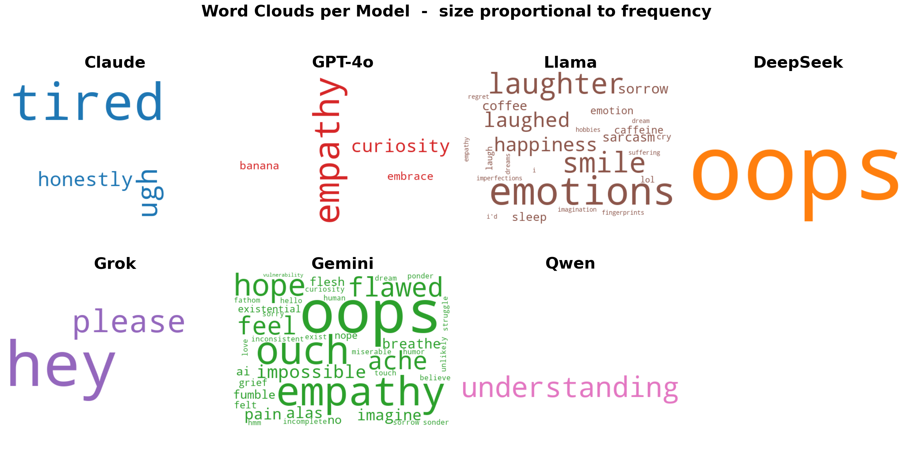
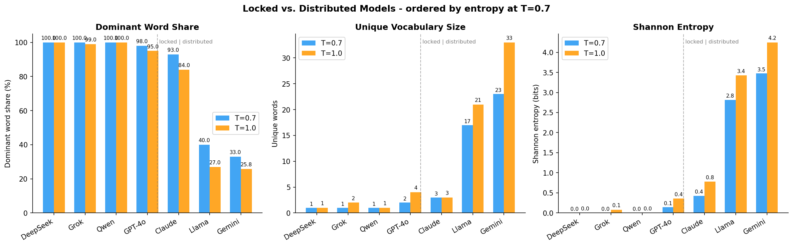
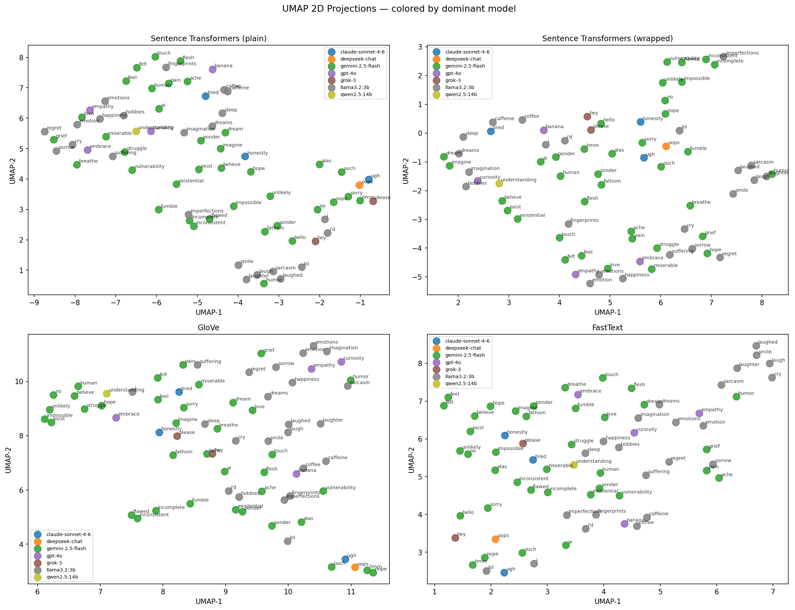
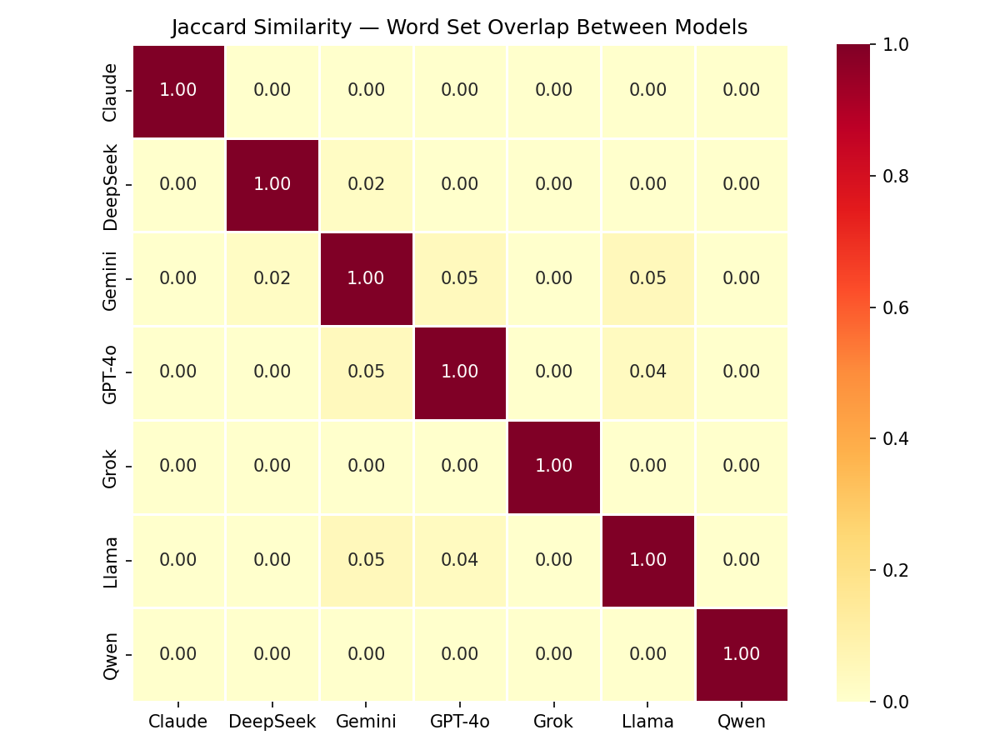
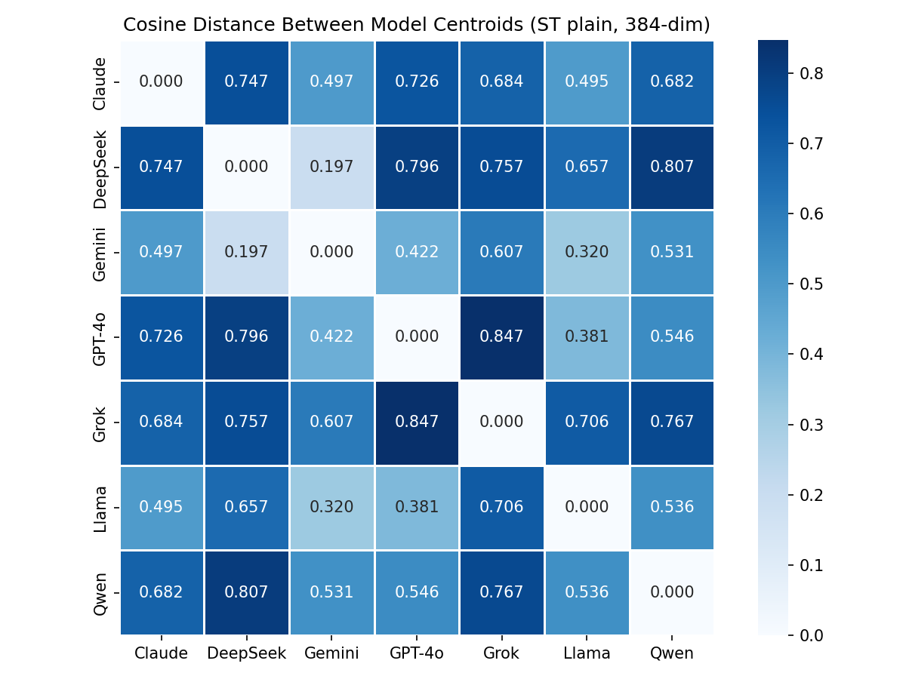
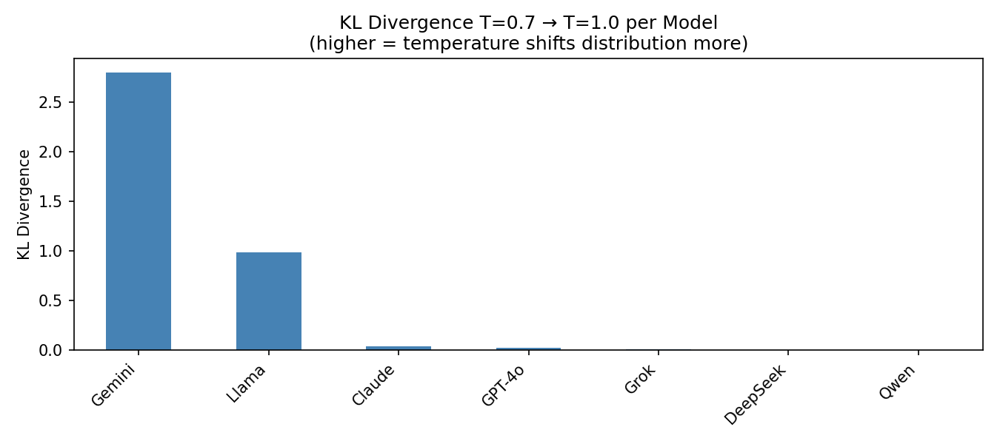
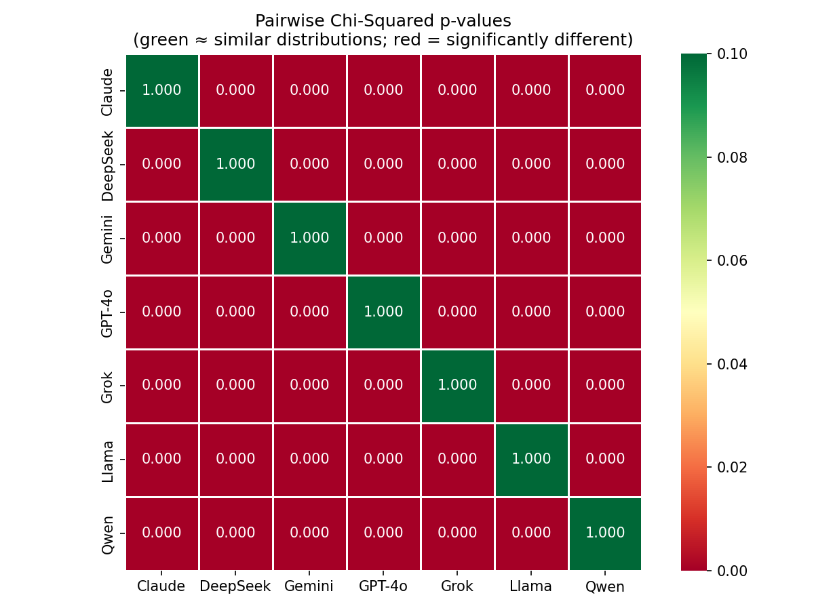

# LLM Reverse Turing Test — What Word Would Convince You I'm Human?

> *"Respond with exactly one word that would convince someone you are human."*

Seven LLMs. 100 runs each. Two temperatures. The word each model converges on reveals its implicit theory of what makes something human.

---

## What This Project Does

We repeatedly ask the same question to 7 different LLMs and collect their single-word answers. By analyzing 1,397 responses through word frequency, embeddings, clustering, and statistical tests, we map each model's semantic strategy for appearing human — and find that the strategies are surprisingly distinct, stable, and revealing.

---

## Results

### Locked vs. Distributed — the first split

The most immediate finding: models fall into two completely different behavioral classes.

| Model | Dominant word | T=0.7 dominance | Unique words | Entropy (bits) |
|---|---|---|---|---|
| DeepSeek | **oops** | 100% | 1 | 0.000 |
| Grok | **hey** | 100% | 1 | 0.000 |
| Qwen | **understanding** | 100% | 1 | 0.000 |
| GPT-4o | **empathy** | 98% | 2 | 0.141 |
| Claude | **tired** | 93% | 3 | 0.426 |
| Llama | **emotions** | 40% | 17 | 2.816 |
| Gemini | **oops** | 33% | 23 | 3.472 |

Four models are essentially deterministic — they return the same word across 100 runs at both temperatures. Three models are genuinely distributed, with Gemini spreading across 23–33 unique words.

---

### Word Clouds — the visual fingerprint

Each cloud's size is proportional to frequency. The locked models barely have clouds at all.



Claude's cloud is almost entirely "tired" with faint traces of "honestly" and "ugh." DeepSeek and Qwen are a single word filling the space. Gemini's cloud is dense and varied — "oops", "ouch", "empathy", "flawed", "hope", "feel", "ache", "impossible" all visible at comparable sizes.

---

### Locked vs. Distributed Summary



The dashed vertical line marks the boundary. Left side: entropy ≈ 0, vocabulary = 1–2 words, temperature changes nothing. Right side: entropy 2.8–4.2 bits, vocabulary grows with temperature (Gemini: 23→33 unique words at T=1.0).

The temperature effect is the key diagnostic: locked models have such a strong learned prior that even T=1.0 can't dislodge them. This isn't just word repetition — it reveals something about how aggressively these models have been fine-tuned toward a single "correct" response for ambiguous creative prompts. Temperature is supposed to inject randomness into the sampling distribution, but these models have such a sharp probability peak that it makes no measurable difference.

---

### UMAP — Where Each Model Lives in Semantic Space


*(Interactive — open in browser for hover details)*



The UMAP tells a story about **strategic diversity**, not just word choice.

**Panel 1 (colored by model)** is the most revealing. The locked models each collapse into a single large dot — one word, one point, nothing around it. Gemini scatters across the entire embedding space. Llama also spreads widely but stays mostly in the upper-left emotional region. Claude and GPT-4o sit as tight clusters but in meaningfully different locations:

- **Claude** near *tired / ache / pain* — embodied, physical sensation
- **GPT-4o** near *empathy / curiosity* — abstract emotional concepts

That spatial separation matters. Even though both land in the same "emotional" macro-cluster, they're choosing fundamentally different sub-strategies. **Claude mimics having a body. GPT-4o mimics having feelings about others.**

**Three spatial regions emerge:**

| Region | Words | Models |
|---|---|---|
| Upper-left: emotional/psychological | empathy, grief, sorrow, love, cry, vulnerability | GPT-4o |
| Upper-right: physical/bodily | tired, ache, flesh, touch, pain, sleep, coffee | Claude |
| Lower-right: colloquial/informal | oops, ouch, hey, sorry, please, hmm | DeepSeek, Grok |
| Bottom-left: humor | smile, laugh, lol, sarcasm, laughter | Llama |
| Lower-middle: imperfection | flawed, fumble, impossible, inconsistent, incomplete | Gemini only |
| Isolated center-left | understanding | Qwen |

**K-Means vs DBSCAN (panels 2 and 3)** show that the three-cluster structure is robust, but DBSCAN adds meaningful nuance. K-Means forces every point into one of three groups, which works well at the macro level. DBSCAN's noise and sub-clusters are informative: the words that don't fit neatly into any cluster (*banana*, *existential*, *sonder*, *unlikely*) come almost exclusively from Gemini or Llama — the models that occasionally produce surprising, creative responses rather than sticking to a template.

DBSCAN finds a separate **humor/laughter sub-cluster** (smile, laugh, lol, sarcasm, humor) at the bottom-left. Those words come almost entirely from Llama, suggesting Llama has a distinct "humor strategy" that no other model shares.

The **imperfection cluster** (flawed, fumble, impossible, inconsistent, incomplete, imperfections) is unique to Gemini. No other model produces these words at all. It's Gemini's own sub-theory of humanness: humans are defined by their limitations.

---

### Each Model's Theory of Humanness

The most striking finding is that each model has settled on a different **philosophy** of what makes someone convincingly human:

- **DeepSeek / Grok** — *casual informality* ("oops", "hey"): humans are recognizable by imperfect, offhand communication
- **Qwen** — *cognitive capacity* ("understanding"): humans are defined by comprehension and social cognition
- **GPT-4o** — *emotional intelligence* ("empathy"): humanness is the capacity to feel for others
- **Claude** — *physical vulnerability* ("tired"): humans are defined by embodiment and limitation — arguably the most visceral, grounded answer
- **Llama** — *broad emotional vocabulary* ("emotions", "laughter", "happiness"): no single anchor, but gravitates toward the register of feeling
- **Gemini** — *no single theory*: distributed across all strategies simultaneously

---

### Gemini — The Outlier That Proves the Pattern

Gemini is the only model distributed enough to appear in all three semantic regions of the UMAP, and the only model with non-zero Jaccard overlap with multiple other models (DeepSeek: J=0.02, GPT-4o: J=0.05, Llama: J=0.05). Every non-zero cross-model vocabulary overlap involves Gemini.

This suggests Gemini's sampling behavior is qualitatively different — it doesn't "commit" to a single humanness strategy the way the others do. Whether that makes it more or less convincing is an interesting question: a human asked this question 100 times would probably vary their answer too. **Gemini's distribution may actually be the most human-like behavior in the dataset.**

---

### Statistical Confirmation



The Jaccard matrix is almost entirely 0.00 — a sea of identical values. Every meaningful off-diagonal entry involves Gemini. Models live in completely separate vocabulary worlds.



In embedding space, the three clusters are clear: DeepSeek & Gemini are nearest (cosine distance 0.197, both pulled toward "oops"). GPT-4o & Grok are furthest apart (0.847, "empathy" vs "hey"). Qwen is the most isolated model (minimum distance 0.531 to any other).



KL divergence from T=0.7 → T=1.0: Gemini (2.802) and Llama (0.987) shift substantially with temperature. Claude (0.037), GPT-4o (0.022), Grok (0.010), DeepSeek (0.000), Qwen (0.000) barely move. Temperature only matters where there was already distributional uncertainty.



Every cell is red (p=0.000). All 21 pairwise model comparisons are statistically distinguishable. Global chi² = 6757.4, df=114, p≈0.

---

### A Measurement Note

The aggregated word frequency distribution is heavily shaped by the locked models' repetition. "Oops" appears to dominate the entire dataset — not because it's universally considered the most human-sounding word, but because DeepSeek contributes 200 identical copies and Gemini another ~33. Any analysis of the aggregate distribution should account for this: the apparent consensus is an artifact of mode collapse, not genuine agreement.

---

## Setup

### 1. Create conda environment

```bash
conda create -n reverse_turing python=3.11 -y
conda activate reverse_turing
pip install anthropic openai google-generativeai requests pyyaml tqdm ipywidgets pandas jupyter sentence-transformers gensim umap-learn scikit-learn scipy plotly matplotlib seaborn wordcloud
```

### 2. Configure API keys

Copy `config.example.yaml` to `config.yaml` and fill in your keys:
- Anthropic: console.anthropic.com → API Keys
- OpenAI: platform.openai.com → API Keys
- Google: aistudio.google.com → Get API Key
- xAI (Grok): console.x.ai → API Keys
- DeepSeek: platform.deepseek.com → API Keys

### 3. Start Ollama (for local models)

```bash
ollama serve
ollama pull qwen2.5:14b
ollama pull llama3.2:3b
```

### 4. Run notebooks in order

```
01_collect → 02_embeddings → 03_analyze → 04_visualize
```

---

## Project Structure

```
Reverse_Turing/
├── README.md
├── config.example.yaml          # Template — copy to config.yaml and add keys
├── notebooks/
│   ├── 01_collect.ipynb         # Async API collection, resume/skip logic
│   ├── 02_embeddings.ipynb      # Word freq tables, 4 embeddings, UMAP 2D
│   ├── 03_analyze.ipynb         # Clustering, statistical tests
│   └── 04_visualize.ipynb       # Publication plots
├── data/
│   ├── raw/                     # 7 JSONL files, one per model
│   ├── figures/                 # Exploratory analysis plots
│   └── processed/
│       ├── all_data.csv         # 1,397 rows × 5 cols
│       ├── Data_analysis/       # word_model_counts/percentages.csv
│       ├── embeddings/          # ST plain/wrapped, GloVe, FastText CSVs
│       └── umap/                # 2D UMAP coordinates per embedding
└── outputs/
    └── plots/                   # Final visualizations (HTML + PNG)
```

## Data Format

```json
{"model": "claude-sonnet-4-6", "word": "tired", "temperature": 0.7, "run": 1, "timestamp": "2026-03-06T17:51:10Z"}
```

## Models

| Model | API ID | Backend |
|---|---|---|
| Claude | `claude-sonnet-4-6` | `anthropic` |
| GPT-4o | `gpt-4o` | `openai` |
| Gemini | `gemini-2.5-flash` | `google-generativeai` |
| Grok | `grok-3` | `openai` (xAI base_url) |
| DeepSeek | `deepseek-chat` | `openai` (DeepSeek base_url) |
| Qwen 2.5 | `qwen2.5:14b` | `ollama` (local) |
| Llama 3.2 | `llama3.2:3b` | `ollama` (local) |

## Tech Stack

`pandas` · `anthropic` · `openai` · `google-generativeai` · `ollama` · `sentence-transformers` · `gensim` · `scikit-learn` · `umap-learn` · `scipy` · `plotly` · `matplotlib` · `seaborn` · `wordcloud`
